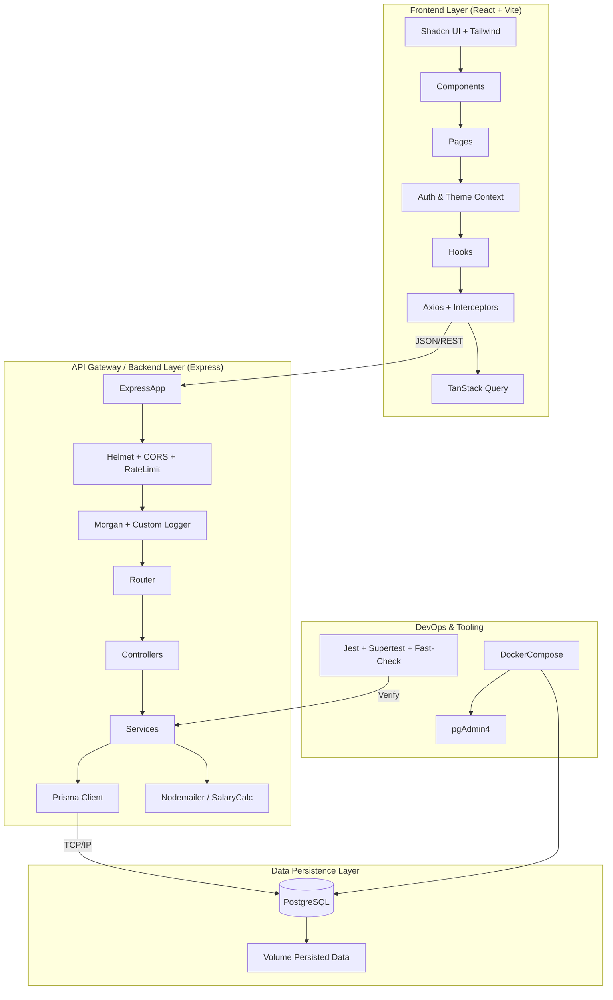

# Dayflow - HR Management System

A comprehensive, enterprise-grade Human Resource Management System (HRMS) engineered for scalability, security, and performance. Built with a modern full-stack architecture leveraging **React (Vite)** on the frontend and **Node.js (Express)** with **Prisma ORM** on the backend.


## 🏗️ Crazy Architecture Overview

Dayflow adopts a robust, **layered monolith architecture** designed for high cohesion and low coupling, containerized with Docker for consistent deployment.



### 🧩 System Components

#### 1. Frontend Architecture (The Client)
- **Framework**: React 18 driven by **Vite** for lightning-fast HMR and builds.
- **State Management**: Hybrid approach using **React Context** for global app state (Theme, Auth) and **TanStack Query (React Query)** for server state synchronization, caching, and optimistic updates.
- **Routing**: **React Router v6** protecting routes based on roles (`Employee`, `Admin`, `HR_Officer`).
- **UI System**: Built on top of **Shadcn UI** (Radix Primitives) and **Tailwind CSS**, ensuring accessibility (a11y) and consistent design tokens.
- **Mocking Strategy**: Dual-mode API client that can switch between **Mock Storage** (localStorage based) and **Production API** seamlessly.

#### 2. Backend Architecture (The Server)
- **Runtime**: **Node.js** with **TypeScript** for strict type safety across the entire stack.
- **Framework**: **Express.js** structured with the **Controller-Service-Repository** pattern.
    - **Controllers**: Handle HTTP requests, validation (Joi/Zod), and response formatting.
    - **Services**: Encapsulate business logic (e.g., Salary calculations, Leave approval workflows).
    - **Prisma Layer**: Type-safe database access, schema migration, and relationship management.
- **Security First**:
    - **JWT** Authentication with Refresh Tokens.
    - **Bcrypt** hashing for passwords.
    - **Helmet** for HTTP header security.
    - **Rate Limiting** to prevent abuse.
- **Logging & Monitoring**: Custom `Logger` utility with distinct levels (INFO, WARN, ERROR) and structured context logging.

#### 3. Database Layer
- **PostgreSQL**: Robust relational database handling complex relationships (Employees -> Attendance, Leaves, Salary).
- **Prisma ORM**: Declarative data modeling (`schema.prisma`) with automated migrations and type generation.
- **Dockerized**: The database runs in an isolated container defined in `docker-compose.yml` for easy setup and teardown.

---

## 🚀 Features

### 🌟 Frontend
- **Role-Based Access**: Dedicated portals for Employees, HR, and Admins.
- **Interactive Dashboards**: Data visualization using **Recharts**.
- **Dark Mode**: System-aware theme toggling.
- **Responsive Design**: Mobile-first layout for on-the-go access.
- **Form Management**: Powered by **React Hook Form** + **Zod** schema validation.

### ⚙️ Backend
- **Authentication**: Secure Login/Logout with Access & Refresh Token rotation.
- **Employee Lifecycle**: CRUD operations with automated Login ID generation (`OI[Name][Year][Serial]`).
- **Attendance Tracking**: Check-in/Check-out logic with working hours calculation.
- **Leave Management**: Request workflow with status updates (Pending -> Approved/Rejected).
- **Payroll Engine**: Automated salary component calculation (Basic, HRA, DA, PF, Tax).
- **Email Notifications**: Integrated **Nodemailer** for alerts (Welcome emails, Leave status).
- **Property-Based Testing**: Using **fast-check** to verify business logic against thousands of random inputs.

---

## 🛠️ Tech Stack

| Category | Technology |
|----------|------------|
| **Frontend** | React, TypeScript, Vite, Tailwind CSS, Shadcn UI, React Query, React Router, Axios, Recharts, Lucide React |
| **Backend** | Node.js, Express, TypeScript, Prisma, PostgreSQL, JWT, Bcrypt, Nodemailer, Helmet, Morgan, Winston (Custom) |
| **Database** | PostgreSQL 15 (Alpine via Docker) |
| **DevOps** | Docker, Docker Compose, ESLint, Prettier, Husky |
| **Testing** | Vitest (Frontend), Jest (Backend), Supertest, Fast-Check (Property-based) |

---

## 📂 Folder Structure

```
DayFlow/
├── .kiro/                  # 🧠 Project specs and requirements
├── frontend/               # ⚛️ Frontend Application
│   ├── src/
│   │   ├── api/            # API Clients (Mock & Production)
│   │   ├── components/     # Reusable UI Components (Shadcn)
│   │   ├── contexts/       # React Context Providers
│   │   ├── hooks/          # Custom Hooks (useAuth, useTheme)
│   │   ├── pages/          # Route Pages (Admin, Employee, Auth)
│   │   └── types/          # Frontend Type Definitions
│   └── vite.config.ts      # Vite Configuration
├── prisma/                 # 🗄️ Database Schema & Migrations
├── src/                    # 🔙 Backend Application
│   ├── config/             # Environment Configuration
│   ├── controllers/        # Request Handlers
│   ├── middleware/         # Auth, Error, Logger Middleware
│   ├── routes/             # API Route Definitions
│   ├── services/           # Business Logic Layer
│   ├── utils/              # Helpers (Logger, Calculator)
│   └── index.ts            # Entry Point
├── docker-compose.yml      # 🐳 Container Orchestration
└── package.json            # Root Dependencies
```

---

## ⚡ Getting Started

### Prerequisites
- **Node.js** (v18+)
- **Docker** & **Docker Compose**
- **Bun** (Optional, but recommended for speed)

### 1. Database Setup
Start the PostgreSQL container:
```bash
docker-compose up -d postgres
```
Wait for it to initialize (check logs with `docker logs dayflow_postgres`).

### 2. Backend Setup
Install dependencies and seed the database:
```bash
# Install root/backend deps
npm install

# Generate Prisma Client
npm run db:generate

# Push Schema to DB
npm run db:push

# Start Backend Server
npm run dev
```
*Server runs on `http://localhost:3000`*

### 3. Frontend Setup
Open a new terminal:
```bash
cd frontend

# Install frontend deps
bun install  # or npm install

# Start Dev Server
bun run dev  # or npm run dev
```
*App runs on `http://localhost:5173`*

---

## 🧪 Testing Strategy

We employ a "Testing Pyramid" approach:
- **Unit Tests**: For utility functions (salary calculators, ID generators).
- **Integration Tests**: Using `Supertest` to verify API endpoints against a test DB.
- **Property-Based Tests**: Using `fast-check` to assert invariants (e.g., "Salary components always sum up to total wage").
- **Component Tests**: Using `Vitest` for UI interaction testing.

Run tests:
```bash
# Backend Tests
npm test

# Frontend Tests
cd frontend && npm test
```

---

## 🤝 Contributing

1. Fork the repo.
2. Create a feature branch (`git checkout -b feature/amazing-feature`).
3. Commit changes (`git commit -m 'Add amazing feature'`).
4. Push to branch (`git push origin feature/amazing-feature`).
5. Open a Pull Request.

---

## 📄 License

MIT License.
